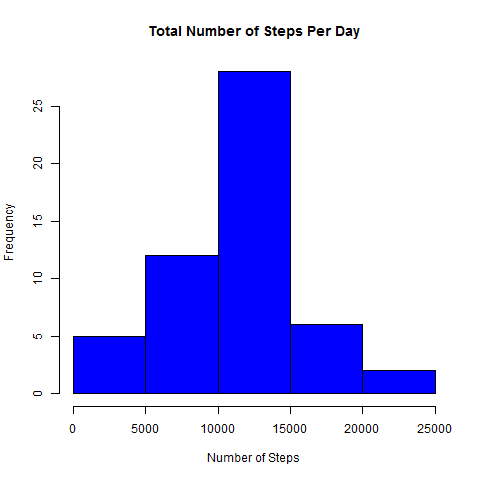

```{r setup, include=FALSE}
knitr::opts_chunk$set(echo = TRUE)
```

## Introduction

It is now possible to collect a large amount of data about personal movement using activity monitoring devices such as a Fitbit, Nike Fuelband, or Jawbone Up. These type of devices are part of the "quantified self" movement - a group of enthusiasts who take measurements about themselves regularly to improve their health, to find patterns in their behavior, or because they are tech geeks. But these data remain under-utilized both because the raw data are hard to obtain and there is a lack of statistical methods and software for processing and interpreting the data.

This assignment makes use of data from a personal activity monitoring device. This device collects data at 5 minute intervals through out the day. The data consists of two months of data from an anonymous individual collected during the months of October and November, 2012 and include the number of steps taken in 5 minute intervals each day.

The data for this assignment can be downloaded from the course web site:

Data set: Activity monitoring data [52K]
The variables included in this data set are:

steps: Number of steps taking in a 5-minute interval (missing values are coded as NA)
date: The date on which the measurement was taken in YYYY-MM-DD format
interval: Identifier for the 5-minute interval in which measurement was taken
The data set is stored in a comma-separated-value (CSV) file and there are a total of 17,568 observations in this data set.

Loading and preprocessing the data

Show any code that is needed to

Load the data (i.e. read.csv())
Process/transform the data (if necessary) into a format suitable for your analysis

```{r}
#assume activity.csv to exist in the current directory
data <- read.csv("activity.csv")
data <- transform(data, date = as.Date(date, "%Y-%m-%d"))
dataNoNa <- na.omit(data)
```

## What is mean total number of steps taken per day?

For now, we are ignoring missing values in the data set.
To answer the question, we create a histogram first. Then, we calculate a mean and medium of the data set

```{r}
#Question 1: What is mean total number of steps taken per day?
#Create a histogram of steps per day
SumStepsPerDay <- aggregate(steps ~ date, data, sum)
hist(SumStepsPerDay$steps, col="blue", xlab="Number of Steps",
     main="Total Number of Steps Per Day")
#Calculate mean and median of total steps per day
Mean1 <- mean(SumStepsPerDay$steps)
Median1 <- median(SumStepsPerDay$steps)
Mean1
Median1
```
 

The mean is `r Mean1` and median is `r Median1`.

## What is the average daily activity pattern?

Next, we make a time series plot of the 5-minute interval and the average number of steps taken, averaged across all days.


```{r}
#Question 2: What is the average daily activity pattern?
#Create a graph of daily activity
avgSteps <- aggregate(steps ~ interval, dataNoNa, mean)
plot(avgSteps$interval, avgSteps$steps, type = "l",
     xlab="5-Minute Interval", ylab = "Average Number of Steps Taken",
     main="Average Number of Steps by 5-Minute Intervals, Across All Days")
#Calculate maximum
maxIndex <- which.max(avgSteps$steps)
maxAvgSteps <- avgSteps$steps[maxIndex]
maxAvgInt <- avgSteps$interval[maxIndex]
maxIndex
maxAvgSteps
maxAvgInt
```
On average across all the days, the 5-minute interval `r maxAvgInt`, contains the maximum number of steps is `r maxAvgSteps`

## Imputing missing values

Note that there are a number of days/intervals where there are missing values (coded as NA). The presence of missing days may introduce bias into some calculations or summaries of the data.

There are a number of days/intervals where there are missing values. The presence of missing days may introduce bias into some calculations or summaries of the data.

The total number of missing values in the data set is 2304. Let's devise a strategy for filling in all of the missing values in the data set. For each NA for the steps value in the activity data set, we shall fill in the mean value for that time interval. We will do this on a copy of the data set.
Now, we look at a histogram of the total number of steps taken each day again, but now with the imputed data set. We also calculate mean and median of the adjusted data set.

```{r}
#Question 3: Imputing missing values
#Counting missing values
NumNA<-sum(is.na(data))
NumNA
#Filling missing values
total <- merge(data,avgSteps,by="interval")
total$StepsAdj<-ifelse(is.na(total$steps.x), total$steps.y, total$steps.x)
dataAdj<-subset(total,select = c(date,interval, StepsAdj))
library(plyr)
dataAdj<-rename(dataAdj, c("StepsAdj"="steps"))
#Create a histogram of steps per day
SumStepsPerDay2 <- aggregate(steps ~ date, dataAdj, sum)
hist(SumStepsPerDay2$steps, col="red", xlab="Number of Steps",
     main="Total Number of Steps Per Day")
#Calculate mean and median of total steps per day
Mean2 <- mean(SumStepsPerDay2$steps)
Median2 <- median(SumStepsPerDay2$steps)
Mean2
Median2
```
After imputing the missing values, the mean total number of steps taken per day is `r Mean2`, and the median is `r Median2`. It can be seen that the median has moved closer to the mean.

## Are there differences in activity patterns between weekdays and weekends?

We will use the data set with the filled-in missing values for this part. First, lets create a new factor variable that indicates whether a given date is a weekday or weekend day.

Next, we make a panel plot containing a time series plot of the 5-minute interval and the average number of steps taken, averaged across all weekday days or weekend days.
```{r}
#Question 4: Are there differences in activity patterns between weekdays and weekends?
#Add Weekday/Weekend indicator of Weekend = 0, Weekday=1
dataAdj <- transform(dataAdj, DayType = ifelse(weekdays(dataAdj$date) %in% c("Saturday", "Sunday"), "Weekend", "Weekday"))
dataAdj <- transform(dataAdj, DayType = factor(DayType))

#Create a graph
TotStepsbyDayType <- aggregate(steps ~ interval + DayType, dataAdj, mean)

library(lattice)
xyplot(steps ~ interval|DayType, data = TotStepsbyDayType,
       type = "l", layout = c(1,2),
       xlab="5-Minute Interval", ylab = "Average Number of Steps Taken",
       main="Average Number of Steps by 5-Minute Intervals (Weekdays vs. Weekends)")
```

